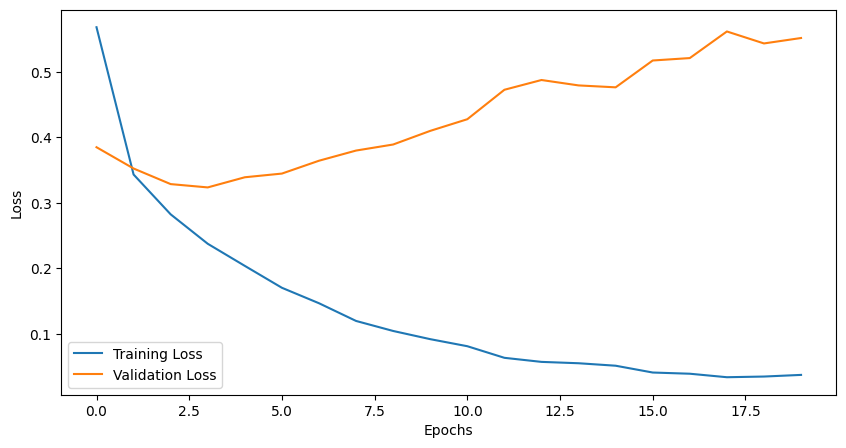
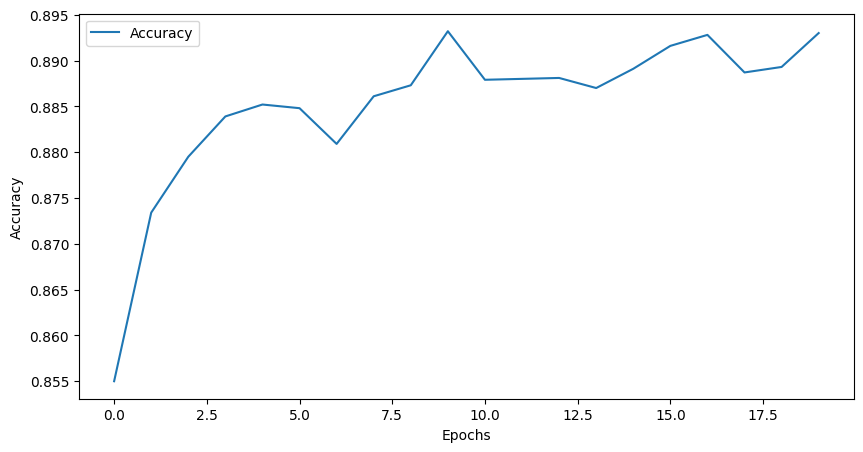

# 3.3 模型训练

经过前两节的学习，我们已经大致了解了ResNet的基本原理及模型构建，接下来几节，我们将基于此模型完成一个基础实战案例，并在其中逐步介绍模型训练过程中的一些关键点。

在此节，我们将展示一个最基础的模型训练过程。

通过本文你将学习到：

- 模型训练
  
- 模型微调
  
- 冻结训练
  

我们这里的任务是对10个类别的“时装”图像进行分类，使用[FashionMNIST数据集](https://github.com/zalandoresearch/fashion-mnist/tree/master/data/fashion )。
下图给出了FashionMNIST中数据的若干样例图，其中每个小图对应一个样本。  
FashionMNIST数据集中包含已经预先划分好的训练集和测试集，其中训练集共60,000张图像，测试集共10,000张图像。每张图像均为单通道黑白图像，大小为28\*28pixel，分属10个类别。  


## 3.3.1 模型定义
导入需要用到的库

```python 
import torch
import torch.nn as nn
import torch.utils.model_zoo as model_zoo
```
封装3x3和1x1的卷积
```python 
def conv3x3(in_planes, out_planes, stride=1, groups=1, dilation=1):
    return nn.Conv2d(
        in_planes,
        out_planes,
        kernel_size=3,
        stride=stride,
        padding=dilation,
        groups=groups,
        bias=False,
        dilation=dilation,
    )


def conv1x1(in_planes, out_planes, stride=1):
    return nn.Conv2d(in_planes, out_planes, kernel_size=1, stride=stride, bias=False)
```

定义ResNet基础模块BasicBlock和BottleNeck
```python
class BasicBlock(nn.Module):
    expansion = 1
    def __init__(self, in_channels, out_channels, stride=1, downsample=None):
        super(BasicBlock, self).__init__()
        self.conv1 = conv3x3(in_channels, out_channels, stride)
        self.bn1 = nn.BatchNorm2d(out_channels)
        self.conv2 = conv3x3(out_channels, out_channels)
        self.bn2 = nn.BatchNorm2d(out_channels)
        self.relu = nn.ReLU(inplace=True)
        self.downsample = downsample

    def forward(self, input):
        residual = input
        x = self.conv1(input)
        x = self.bn1(x)
        x = self.relu(x)
        x = self.conv2(x)
        x = self.bn2(x)
        if self.downsample:
            residual = self.downsample(residual)
        x += residual
        x = self.relu(x)
        return x


class BottleNeck(nn.Module):
    expansion = 4
    def __init__(self, in_channels, out_channels, stride=1, downsample=None):
        super(BottleNeck, self).__init__()
        self.conv1 = conv1x1(in_channels, out_channels)
        self.bn1 = nn.BatchNorm2d(out_channels)
        self.conv2 = conv3x3(out_channels, out_channels, stride)
        self.bn2 = nn.BatchNorm2d(out_channels)
        self.conv3 = conv1x1(out_channels, out_channels*self.expansion)
        self.bn3 = nn.BatchNorm2d(out_channels*self.expansion)
        self.relu = nn.ReLU(inplace=True)
        self.downsample = downsample
    def forward(self, input):
        residual = input
        x = self.conv1(input)
        x = self.bn1(x)
        x = self.relu(x)
        x = self.conv2(x)
        x = self.bn2(x)
        x = self.relu(x)
        x = self.conv3(x)
        x = self.bn3(x)
        if self.downsample:
            residual = self.downsample(residual)
        x += residual
        x = self.relu(x)
        return x
```
定义ResNet模块
```python
class ResNet(nn.Module):
    def __init__(self, block, num_layer, n_classes=1000, input_channels=3):
        super(ResNet, self).__init__()
        self.in_channels = 64
        self.conv1 = nn.Conv2d(input_channels, 64, kernel_size=7, stride=2, padding=3, bias=False)
        self.bn1 = nn.BatchNorm2d(64)
        self.maxpool = nn.MaxPool2d(3, stride=2, padding=1)
        self.relu = nn.ReLU(inplace=True)
        self.layer1 = self._make_layer(block, 64, num_layer[0])
        self.layer2 = self._make_layer(block, 128, num_layer[1], 2)
        self.layer3 = self._make_layer(block, 256, num_layer[2], 2)
        self.layer4 = self._make_layer(block, 512, num_layer[3], 2)
        self.avgpool = nn.AdaptiveAvgPool2d((1, 1))
        self.fc = nn.Linear(block.expansion*512, n_classes)

        for m in self.modules():
            if isinstance(m, nn.Conv2d):
                nn.init.kaiming_normal_(m.weight, mode='fan_out', nonlinearity='relu')
            elif isinstance(m, nn.BatchNorm2d):
                nn.init.constant_(m.weight, 1.0)
                nn.init.constant_(m.bias, 0.0)


    def _make_layer(self, block, out_channels, num_block, stride=1):
        downsample = None
        if stride != 1 or self.in_channels != out_channels*block.expansion:
            downsample = nn.Sequential(
                nn.Conv2d(self.in_channels, out_channels*block.expansion, 1, stride=stride, bias=False),
                nn.BatchNorm2d(out_channels*block.expansion)
            )
        layers = []
        layers.append(block(self.in_channels, out_channels, stride, downsample))
        self.in_channels = out_channels*block.expansion
        for _ in range(1, num_block):
            layers.append(block(self.in_channels, out_channels))
        return nn.Sequential(*layers)

    def forward(self, input):
        x = self.conv1(input)
        x = self.bn1(x)
        x = self.relu(x)
        x = self.maxpool(x)

        x = self.layer1(x)
        x = self.layer2(x)
        x = self.layer3(x)
        x = self.layer4(x)
        
        x = self.avgpool(x)
        x = torch.flatten(x, 1)
        x = self.fc(x)
        return x
```
模型实例化函数
```python
model_urls = {
    'resnet18': 'https://download.pytorch.org/models/resnet18-5c106cde.pth',
    'resnet34': 'https://download.pytorch.org/models/resnet34-333f7ec4.pth',
    'resnet50': 'https://download.pytorch.org/models/resnet50-19c8e357.pth',
    'resnet101': 'https://download.pytorch.org/models/resnet101-5d3b4d8f.pth',
    'resnet152': 'https://download.pytorch.org/models/resnet152-b121ed2d.pth',
} # 定义每个模型对应的预训练权重下载路径

def resnet18(pretrained=False, **kwargs):
    model = ResNet(BasicBlock, [2, 2, 2, 2], **kwargs)
    if pretrained:
        model.load_state_dict(model_zoo.load_url(model_urls['resnet18'])) # 下载使用预训练权重
    return model


def resnet34(pretrained=False, **kwargs):
    model = ResNet(BasicBlock, [3, 4, 6, 3], **kwargs)
    if pretrained:
        model.load_state_dict(model_zoo.load_url(model_urls['resnet34']))
    return model


def resnet50(pretrained=False, **kwargs):
    model = ResNet(BottleNeck, [3, 4, 6, 3], **kwargs)
    if pretrained:
        model.load_state_dict(model_zoo.load_url(model_urls['resnet50']))
    return model

def resnet101(pretrained=False, **kwargs):
    model = ResNet(BottleNeck, [3, 4, 23, 3], **kwargs)
    if pretrained:
        model.load_state_dict(model_zoo.load_url(model_urls['resnet101']))
    return model

def resnet152(pretrained=False, **kwargs):
    model = ResNet(BottleNeck, [3, 8, 36, 3], **kwargs)
    if pretrained:
        model.load_state_dict(model_zoo.load_url(model_urls['resnet152']))
    return model
```

## 3.3.2 模型定义
考虑到ResNet的最终分类结果是1000种，所以我们重新定义一个自己的网络。以先前的ResNet结构作为骨干网络，并在最后添加一层新的线性层用来修改最终的分类数量

以ResNet18为基础模型：
```python
class ResNet18(nn.Module):
    def __init__(self, classes):
        super(ResNet18, self).__init__()
        self.resnet = resnet18() # 定义原始ResNet18结构
        self.fc = nn.Linear(self.resnet.fc.out_features, classes) # self.resnet.fc.out_features用于获取原始全连接层的输出通道数
    def forward(self, x):
        x = self.resnet(x)
        x = self.fc(x)
        return x
model = ResNet18(classes = 10)
model # 打印模型信息
```
```
ResNet18(
  (resnet): ResNet(
    (conv1): Conv2d(3, 64, kernel_size=(7, 7), stride=(2, 2), padding=(3, 3), bias=False)
    (bn1): BatchNorm2d(64, eps=1e-05, momentum=0.1, affine=True, track_running_stats=True)
    (maxpool): MaxPool2d(kernel_size=3, stride=2, padding=1, dilation=1, ceil_mode=False)
    (relu): ReLU(inplace=True)
    (layer1): Sequential(
      (0): BasicBlock(
        (conv1): Conv2d(64, 64, kernel_size=(3, 3), stride=(1, 1), padding=(1, 1), bias=False)
        (bn1): BatchNorm2d(64, eps=1e-05, momentum=0.1, affine=True, track_running_stats=True)
        (conv2): Conv2d(64, 64, kernel_size=(3, 3), stride=(1, 1), padding=(1, 1), bias=False)
        (bn2): BatchNorm2d(64, eps=1e-05, momentum=0.1, affine=True, track_running_stats=True)
        (relu): ReLU(inplace=True)
      )
      (1): BasicBlock(
        (conv1): Conv2d(64, 64, kernel_size=(3, 3), stride=(1, 1), padding=(1, 1), bias=False)
        (bn1): BatchNorm2d(64, eps=1e-05, momentum=0.1, affine=True, track_running_stats=True)
        (conv2): Conv2d(64, 64, kernel_size=(3, 3), stride=(1, 1), padding=(1, 1), bias=False)
        (bn2): BatchNorm2d(64, eps=1e-05, momentum=0.1, affine=True, track_running_stats=True)
        (relu): ReLU(inplace=True)
      )
    )
    (layer2): Sequential(
      (0): BasicBlock(
        (conv1): Conv2d(64, 128, kernel_size=(3, 3), stride=(2, 2), padding=(1, 1), bias=False)
        (bn1): BatchNorm2d(128, eps=1e-05, momentum=0.1, affine=True, track_running_stats=True)
        (conv2): Conv2d(128, 128, kernel_size=(3, 3), stride=(1, 1), padding=(1, 1), bias=False)
        (bn2): BatchNorm2d(128, eps=1e-05, momentum=0.1, affine=True, track_running_stats=True)
        (relu): ReLU(inplace=True)
        (downsample): Sequential(
          (0): Conv2d(64, 128, kernel_size=(1, 1), stride=(2, 2), bias=False)
          (1): BatchNorm2d(128, eps=1e-05, momentum=0.1, affine=True, track_running_stats=True)
        )
      )
      (1): BasicBlock(
        (conv1): Conv2d(128, 128, kernel_size=(3, 3), stride=(1, 1), padding=(1, 1), bias=False)
        (bn1): BatchNorm2d(128, eps=1e-05, momentum=0.1, affine=True, track_running_stats=True)
        (conv2): Conv2d(128, 128, kernel_size=(3, 3), stride=(1, 1), padding=(1, 1), bias=False)
        (bn2): BatchNorm2d(128, eps=1e-05, momentum=0.1, affine=True, track_running_stats=True)
        (relu): ReLU(inplace=True)
      )
    )
    (layer3): Sequential(
      (0): BasicBlock(
        (conv1): Conv2d(128, 256, kernel_size=(3, 3), stride=(2, 2), padding=(1, 1), bias=False)
        (bn1): BatchNorm2d(256, eps=1e-05, momentum=0.1, affine=True, track_running_stats=True)
        (conv2): Conv2d(256, 256, kernel_size=(3, 3), stride=(1, 1), padding=(1, 1), bias=False)
        (bn2): BatchNorm2d(256, eps=1e-05, momentum=0.1, affine=True, track_running_stats=True)
        (relu): ReLU(inplace=True)
        (downsample): Sequential(
          (0): Conv2d(128, 256, kernel_size=(1, 1), stride=(2, 2), bias=False)
          (1): BatchNorm2d(256, eps=1e-05, momentum=0.1, affine=True, track_running_stats=True)
        )
      )
      (1): BasicBlock(
        (conv1): Conv2d(256, 256, kernel_size=(3, 3), stride=(1, 1), padding=(1, 1), bias=False)
        (bn1): BatchNorm2d(256, eps=1e-05, momentum=0.1, affine=True, track_running_stats=True)
        (conv2): Conv2d(256, 256, kernel_size=(3, 3), stride=(1, 1), padding=(1, 1), bias=False)
        (bn2): BatchNorm2d(256, eps=1e-05, momentum=0.1, affine=True, track_running_stats=True)
        (relu): ReLU(inplace=True)
      )
    )
    (layer4): Sequential(
      (0): BasicBlock(
        (conv1): Conv2d(256, 512, kernel_size=(3, 3), stride=(2, 2), padding=(1, 1), bias=False)
        (bn1): BatchNorm2d(512, eps=1e-05, momentum=0.1, affine=True, track_running_stats=True)
        (conv2): Conv2d(512, 512, kernel_size=(3, 3), stride=(1, 1), padding=(1, 1), bias=False)
        (bn2): BatchNorm2d(512, eps=1e-05, momentum=0.1, affine=True, track_running_stats=True)
        (relu): ReLU(inplace=True)
        (downsample): Sequential(
          (0): Conv2d(256, 512, kernel_size=(1, 1), stride=(2, 2), bias=False)
          (1): BatchNorm2d(512, eps=1e-05, momentum=0.1, affine=True, track_running_stats=True)
        )
      )
      (1): BasicBlock(
        (conv1): Conv2d(512, 512, kernel_size=(3, 3), stride=(1, 1), padding=(1, 1), bias=False)
        (bn1): BatchNorm2d(512, eps=1e-05, momentum=0.1, affine=True, track_running_stats=True)
        (conv2): Conv2d(512, 512, kernel_size=(3, 3), stride=(1, 1), padding=(1, 1), bias=False)
        (bn2): BatchNorm2d(512, eps=1e-05, momentum=0.1, affine=True, track_running_stats=True)
        (relu): ReLU(inplace=True)
      )
    )
    (avgpool): AdaptiveAvgPool2d(output_size=(1, 1))
    (fc): Linear(in_features=512, out_features=1000, bias=True)
  )
  (fc): Linear(in_features=1000, out_features=10, bias=True)
)
```

## 3.3.3 数据读入和加载 
这里同时展示两种方式:  
- 下载并使用PyTorch提供的内置数据集  
- 从网站下载以csv格式存储的数据，读入并转成预期的格式    
第一种数据读入方式只适用于常见的数据集，如MNIST，CIFAR10等，PyTorch官方提供了数据下载。这种方式往往适用于快速测试方法（比如测试下某个idea在MNIST数据集上是否有效）  
第二种数据读入方式需要自己构建Dataset，这对于PyTorch应用于自己的工作中十分重要  
  
同时，还需要对数据进行必要的变换，比如说需要将图片统一为一致的大小，以便后续能够输入网络训练；需要将数据格式转为Tensor类，等等。
  
这些变换可以很方便地借助torchvision包来完成，这是PyTorch官方用于图像处理的工具库，上面提到的使用内置数据集的方式也要用到。PyTorch的一大方便之处就在于它是一整套“生态”，有着官方和第三方各个领域的支持。这些内容我们会在下一节中介绍。


```python
# 首先设置数据变换
from torchvision import transforms

image_size = 28
data_transform = transforms.Compose([
    transforms.ToPILImage(),  
     # 这一步取决于后续的数据读取方式，如果使用内置数据集读取方式则不需要
    transforms.Grayscale(num_output_channels=3),# 用于将单通道灰度图转为三通道
    transforms.Resize(image_size),
    transforms.ToTensor()
])
```


```python
## 读取方式一：使用torchvision自带数据集，下载可能需要一段时间
from torchvision import datasets

train_data = datasets.FashionMNIST(root='./', train=True, download=True, transform=data_transform)
test_data = datasets.FashionMNIST(root='./', train=False, download=True, transform=data_transform)
```

    /data1/ljq/anaconda3/envs/smp/lib/python3.8/site-packages/torchvision/datasets/mnist.py:498: UserWarning: The given NumPy array is not writeable, and PyTorch does not support non-writeable tensors. This means you can write to the underlying (supposedly non-writeable) NumPy array using the tensor. You may want to copy the array to protect its data or make it writeable before converting it to a tensor. This type of warning will be suppressed for the rest of this program. (Triggered internally at  /opt/conda/conda-bld/pytorch_1623448234945/work/torch/csrc/utils/tensor_numpy.cpp:180.)
      return torch.from_numpy(parsed.astype(m[2], copy=False)).view(*s)
    


```python
## 读取方式二：读入csv格式的数据，自行构建Dataset类
# csv数据下载链接：https://www.kaggle.com/zalando-research/fashionmnist
class FMDataset(Dataset):
    def __init__(self, df, transform=None):
        self.df = df
        self.transform = transform
        self.images = df.iloc[:,1:].values.astype(np.uint8)
        self.labels = df.iloc[:, 0].values
        
    def __len__(self):
        return len(self.images)
    
    def __getitem__(self, idx):
        image = self.images[idx].reshape(28,28,1)
        label = int(self.labels[idx])
        if self.transform is not None:
            image = self.transform(image)
        else:
            image = torch.tensor(image/255., dtype=torch.float)
        label = torch.tensor(label, dtype=torch.long)
        return image, label

train_df = pd.read_csv("./FashionMNIST/fashion-mnist_train.csv")
test_df = pd.read_csv("./FashionMNIST/fashion-mnist_test.csv")
train_data = FMDataset(train_df, data_transform)
test_data = FMDataset(test_df, data_transform)
```

在构建训练和测试数据集完成后，需要定义DataLoader类，以便在训练和测试时加载数据  


```python
train_loader = DataLoader(train_data, batch_size=256, shuffle=True, num_workers=0, drop_last=True)
test_loader = DataLoader(test_data, batch_size=256, shuffle=False, num_workers=0)
```

读入后，我们可以做一些数据可视化操作，主要是验证我们读入的数据是否正确


```python
import matplotlib.pyplot as plt
image, label = next(iter(train_loader))
print(image.shape, label.shape)
plt.imshow(image[0][0], cmap="gray")
```

    torch.Size([256, 3, 28, 28])
    torch.Size([256])   
    <matplotlib.image.AxesImage at 0x7f19a043cc10>

<div align=center></div>
    
## 3.3.4 损失函数和优化器定义
使用torch.nn模块自带的CrossEntropy损失
PyTorch会自动把整数型的label转为one-hot型，用于计算CE loss
这里需要确保label是从0开始的，同时模型不加softmax层（使用logits计算）,这也说明了PyTorch训练中各个部分不是独立的，需要通盘考虑
```python
criterion = nn.CrossEntropyLoss()
```
这里我们使用Adam优化器
```python
optimizer = optim.Adam(model.parameters(), lr=1e-3)
```
## 3.3.5 训练和测试（验证）
各自封装成函数，方便后续调用  
关注两者的主要区别：  
- 模型状态设置  
- 是否需要初始化优化器
- 是否需要将loss传回到网络
- 是否需要每步更新optimizer  
  
此外，对于测试或验证过程，可以计算分类准确率，并对训练损失及验证精度记录，方便后续绘图


```python
device = "cuda" if torch.cuda.is_available() else "cpu" 
def train(epoch, train_losses, val_losses):
    model.train()
    train_loss = 0
    for data, label in train_loader:
        data, label = data.to(device), label.to(device)
        optimizer.zero_grad()
        output = model(data)
        loss = criterion(output, label)
        loss.backward()
        optimizer.step()
        train_loss += loss.item() * data.size(0)
    train_loss = train_loss / len(train_loader.dataset)
    train_losses.append(train_loss)  # 记录训练损失
    print('Epoch: {} \tTraining Loss: {:.6f}'.format(epoch, train_loss))
```
```python
def val(epoch, accuracies):
    model.eval()
    val_loss = 0
    gt_labels = []
    pred_labels = []
    with torch.no_grad():
        for data, label in test_loader:
            data, label = data.to(device), label.to(device)
            output = model(data)
            preds = torch.argmax(output, 1)
            gt_labels.append(label.cpu().data.numpy())
            pred_labels.append(preds.cpu().data.numpy())
            loss = criterion(output, label)
            val_loss += loss.item() * data.size(0)
    val_loss = val_loss / len(test_loader.dataset)
    val_losses.append(val_loss)  # 记录验证损失
    gt_labels, pred_labels = np.concatenate(gt_labels), np.concatenate(pred_labels)
    acc = np.sum(gt_labels == pred_labels) / len(pred_labels)
    accuracies.append(acc)  # 记录准确度
    print('Epoch: {} \tValidation Loss: {:.6f}, Accuracy: {:6f}'.format(epoch, val_loss, acc))
```


```python
train_losses = []
val_losses = []
accuracies = []
epochs = 20
model.to(device)
for epoch in range(1, epochs+1):
    train(epoch)
    val(epoch)
```
### 训练结果
```
Epoch: 1 	Training Loss: 0.486617
Epoch: 1 	Validation Loss: 0.355827, Accuracy: 0.867900
Epoch: 2 	Training Loss: 0.284385
Epoch: 2 	Validation Loss: 0.319084, Accuracy: 0.881100
Epoch: 3 	Training Loss: 0.208332
Epoch: 3 	Validation Loss: 0.326341, Accuracy: 0.885900
Epoch: 4 	Training Loss: 0.148077
Epoch: 4 	Validation Loss: 0.343557, Accuracy: 0.881400
Epoch: 5 	Training Loss: 0.103128
Epoch: 5 	Validation Loss: 0.359883, Accuracy: 0.888200
Epoch: 6 	Training Loss: 0.070571
Epoch: 6 	Validation Loss: 0.379490, Accuracy: 0.890800
Epoch: 7 	Training Loss: 0.054285
Epoch: 7 	Validation Loss: 0.462262, Accuracy: 0.880400
Epoch: 8 	Training Loss: 0.046740
Epoch: 8 	Validation Loss: 0.422872, Accuracy: 0.887900
Epoch: 9 	Training Loss: 0.032595
Epoch: 9 	Validation Loss: 0.514826, Accuracy: 0.884600
Epoch: 10 	Training Loss: 0.037929
Epoch: 10 	Validation Loss: 0.503016, Accuracy: 0.884100
Epoch: 11 	Training Loss: 0.030716
Epoch: 11 	Validation Loss: 0.499823, Accuracy: 0.883800
Epoch: 12 	Training Loss: 0.031423
Epoch: 12 	Validation Loss: 0.514255, Accuracy: 0.888500
Epoch: 13 	Training Loss: 0.026313
Epoch: 13 	Validation Loss: 0.541484, Accuracy: 0.888300
Epoch: 14 	Training Loss: 0.024059
Epoch: 14 	Validation Loss: 0.519490, Accuracy: 0.892700
Epoch: 15 	Training Loss: 0.029204
Epoch: 15 	Validation Loss: 0.502099, Accuracy: 0.888300
Epoch: 16 	Training Loss: 0.023112
Epoch: 16 	Validation Loss: 0.500475, Accuracy: 0.893800
Epoch: 17 	Training Loss: 0.012763
Epoch: 17 	Validation Loss: 0.563012, Accuracy: 0.891000
Epoch: 18 	Training Loss: 0.020942
Epoch: 18 	Validation Loss: 0.538688, Accuracy: 0.892800
Epoch: 19 	Training Loss: 0.024664
Epoch: 19 	Validation Loss: 0.529675, Accuracy: 0.891500
Epoch: 20 	Training Loss: 0.017787
Epoch: 20 	Validation Loss: 0.560295, Accuracy: 0.892100
```
使用matplotlib库绘制训练曲线
```python
import matplotlib.pyplot as plt
import numpy as np

# 绘制训练和验证损失曲线
plt.figure(figsize=(10, 5))
plt.plot(train_losses, label='Training Loss')
plt.plot(val_losses, label='Validation Loss')
plt.xlabel('Epochs')
plt.ylabel('Loss')
plt.legend()
plt.show()

# 绘制准确度曲线
plt.figure(figsize=(10, 5))
plt.plot(accuracies, label='Accuracy')
plt.xlabel('Epochs')
plt.ylabel('Accuracy')
plt.legend()
plt.show()

```




## 3.3.7 结果分析

我们通过观察最终的曲线，可以发现以下几点：
- 训练集的损失持续下降
- 验证集的损失在早期下降后开始上升
- 验证集的准确度开始在一个区间内波动

对以上结果分析后可以得出，ResNet18在此数据集上已经趋于过拟合状态，因此我们可以使用数据增强来缓解这种情况，下一节中我们将介绍数据增强方法。

## 参考

1. [FashionMNIST数据集](https://www.kaggle.com/zalando-research/fashionmnist)

2. [ResNet源码](https://github.com/pytorch/vision/blob/main/torchvision/models/resnet.py)